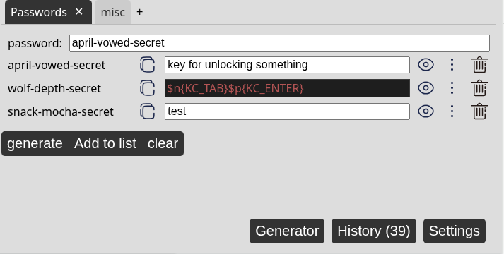
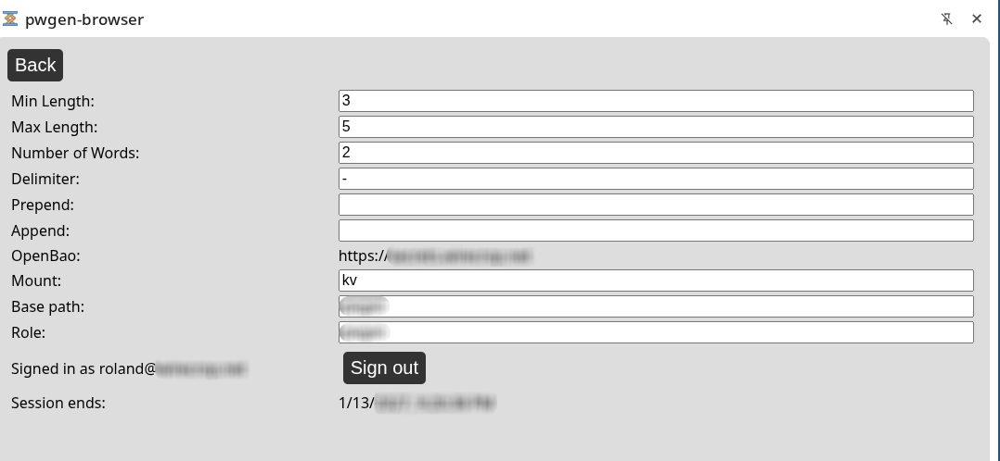

# Password Generator Plugin

A Chrome extension based on [pwgen-js](https://github.com/RolandWarburton/pwgen-js). It generates word-list passwords in Chrome's side panel and saves them in [OpenBao](https://openbao.org/), organised in tabs.

## Screenshots



Generate a password and save it to a tab.



Change the parameters of passwords generated.

## Features

- Generate passwords, copy them or show them as a QR code. Generating works without signing in.
- Save passwords to tabs. Saved passwords live in OpenBao, not in the browser, so they're the same on every device and disappear from the panel when they're deleted in OpenBao.
- Notes, flags and hiding per password, also stored in OpenBao.
- Edit a saved password: each change is kept as a new OpenBao version.
- Sign in once through Dex (OIDC).
- MCP server (`mcp/`) included!

## Installing

1. Copy `.env.example` to `.env` and set `BAO_ADDR` to your OpenBao address, then `deno task build` (needs [Deno](https://deno.com) 2.x).
2. Go to `chrome://extensions/`, enable developer mode and click **Load unpacked**. Choose the `dist` folder, not the root of the repository.
3. Check the extension ID is `lmlfepmjcaglddfjhnegdfmfdheacjcj`. The `key` in `manifest.json` fixes it, and the OpenBao sign-in only accepts that ID (or [your own](#using-your-own-extension-id)).
4. Click the toolbar icon to open the side panel, go to **Settings** and click **Sign in**.

The first sign-in creates **Tab 1**. Double-click a tab to rename it; **+** adds one.

## Using your own extension ID

The ID is derived from the public `key` in `manifest.json`. To use your own, generate a key pair in the repository root (`*.pem` is gitignored):

```sh
openssl genrsa 2048 | openssl pkcs8 -topk8 -nocrypt -out key.pem

# the manifest "key"
openssl rsa -in key.pem -pubout -outform DER | base64 -w0

# the extension ID: first 32 hex chars of the key's SHA-256, mapped 0-f -> a-p
openssl rsa -in key.pem -pubout -outform DER | sha256sum | head -c32 | tr 0-9a-f a-p
```

1. Replace `key` in `manifest.json` with the first output, rebuild and reload. `chrome://extensions/` should show the new ID.
2. Replace `lmlfepmjcaglddfjhnegdfmfdheacjcj` with the new ID in the redirect URI `https://<id>.chromiumapp.org/cb`, both in the Dex `openbao` client and in the OpenBao role's `allowed_redirect_uris` (see below).

Keep `key.pem` safe: anyone with it can publish an extension with the same ID.

## Server setup

The extension expects OpenBao with a KV v2 mount `kv`, signing in through Dex.
Its address is set at build time from `BAO_ADDR` (environment or `.env`); `scripts/build.ts` writes it to `src/config.gen.ts`, which is bundled, and into `host_permissions`.

**Policy** `pwgen-user` (and an identical `pwgen-mcp` for the MCP server):

```hcl
path "kv/data/pwgen/*"     { capabilities = ["create", "read", "update", "patch", "delete"] }
path "kv/metadata/pwgen/*" { capabilities = ["list", "read", "patch", "delete"] }
path "kv/metadata/pwgen"   { capabilities = ["list"] }
```

**Dex** static client `openbao` (with a secret), redirect URI `https://lmlfepmjcaglddfjhnegdfmfdheacjcj.chromiumapp.org/cb`.

**OpenBao OIDC** (`bao auth enable oidc`, `auth/oidc/config` pointing at Dex with client `openbao`), role `pwgen`:

```json
{
  "role_type": "oidc",
  "user_claim": "email",
  "oidc_scopes": ["openid", "email", "profile"],
  "allowed_redirect_uris": ["https://lmlfepmjcaglddfjhnegdfmfdheacjcj.chromiumapp.org/cb"],
  "bound_claims": { "email": ["you@example.net"] },
  "token_policies": ["pwgen-user"],
  "token_ttl": "2376h",
  "token_max_ttl": "2376h"
}
```

## MCP server and claude.ai

`mcp/` is an HTTP MCP server that runs in Docker behind Traefik. It needs:

- a Dex public (PKCE) client `pwgen-mcp` with redirect URI `https://claude.ai/api/mcp/auth_callback`
- an OpenBao AppRole with the `pwgen-mcp` policy:
  `bao write auth/approle/role/pwgen-mcp-server token_policies=pwgen-mcp token_ttl=1h token_max_ttl=24h`

Copy `mcp/.env.example` to `mcp/.env`, fill in the role ID, secret ID and your hosts, then `docker compose up -d --build`. In claude.ai, add a custom connector with the `/mcp` URL and OAuth client ID `pwgen-mcp`.

## Development

```sh
deno task build          # bundle to dist/
deno task lint
deno task check          # type-check
cd mcp && npm run build  # MCP server (still Node)
```

There is no dev server: rebuild and reload the extension in `chrome://extensions/`.
