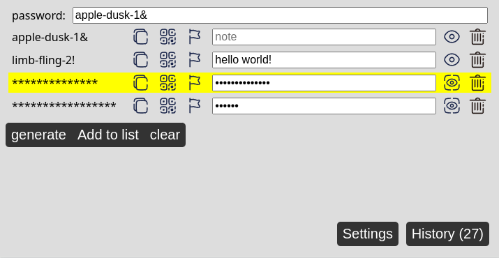
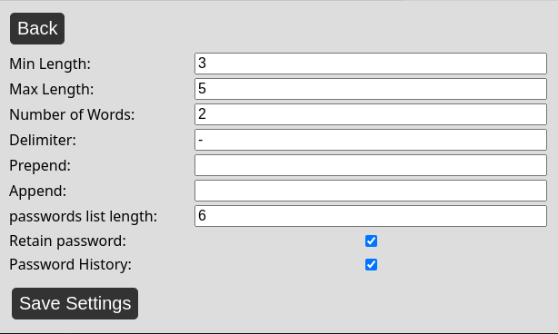

# Password Generator Plugin

Implements a browser extension based on [pwgen-js](https://github.com/RolandWarburton/pwgen-js).

## Screenshots

Generate a password, store up to 5 previously generated passwords.

Change the parameters of passwords generated.

## Packaging

Rebuild the source using `node build.js`.

Load under `chrome://extensions/`. Enable developer mode and then click on `Load unpacked`.
Package the dist folder, not the root of the repository.
